<p align="center">

  <h1 align="center">Spatial-Frequency Enhanced Mamba for Multi-Modal Image Fusion</h1>
<p align="center">
    <a href="https://arxiv.org/pdf/2511.06593v1" rel="external nofollow noopener" target="_blank">TIP 2025 Paper</a>


**SFMFusion** is a novel multi-modal image fusion framework designed to integrate complementary information from different modalities. Unlike traditional CNN- or Transformer-based methods that suffer from limited receptive fields or high computational cost, SFMFusion leverages Mamba to model long-range dependencies with linear complexity. Built upon this foundation, SFMFusion enhances Mamba with full spatial and frequency perceptions through the proposed Spatial-Frequency Enhanced Mamba Block, and efficiently couples fusion with image reconstruction via a three-branch structure. In addition, the Dynamic Fusion Mamba Block enables flexible feature aggregation across branches. Extensive experiments on six MMIF datasets demonstrate that SFMFusion achieves superior performance and provides a promising solution for multi-modal image fusion.

## News
Exciting news! Our paper has been accepted by the TIP 2025! 🎉 [Paper](<https://arxiv.org/pdf/2511.06593v1>)

## Table of Contents

- [Introduction](#introduction)
- [Contributions](#contributions)
- [Results](#results)
- [Visualizations](#visualizations)
- [Reproduction](#reproduction)
- [Citation](#citation)


## Introduction
SFMFusion is a Multi-Modal Image Fusion framework based on the Spatial-Frequency enhanced Mamba. This repository provides the training and testing code, along with pretrained weights for reproducing the results in our paper.

## Contributions

  - We propose a novel framework named SFMFusion for MMIF, which enhances content preservation through IR.
  - We propose the Spatial-Frequency Enhanced Mamba Block (SFMB) to enhance Mamba in both spatial and frequency domains for comprehensive feature extraction.
  - We propose the Dynamic Fusion Mamba Block (DFMB) to dynamically fuse the features from different branches.
  - Extensive experiments on six public benchmarks demonstrate that our method achieves better performances than most state-of-the-art methods.

## Results
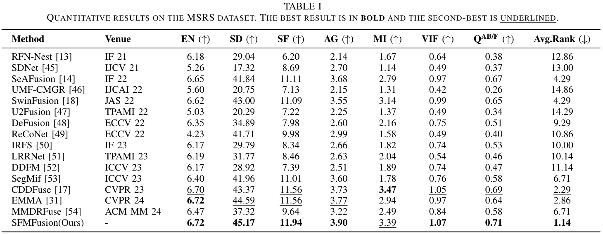
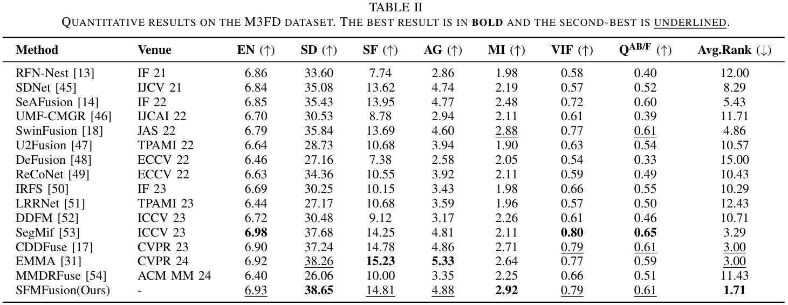
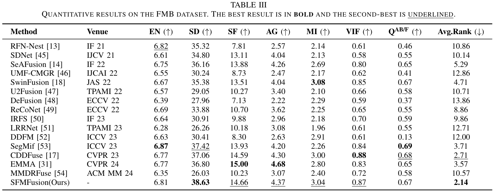
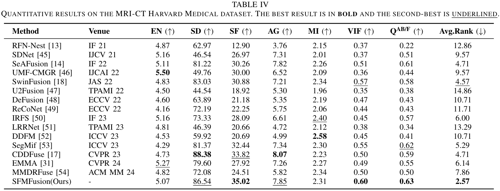
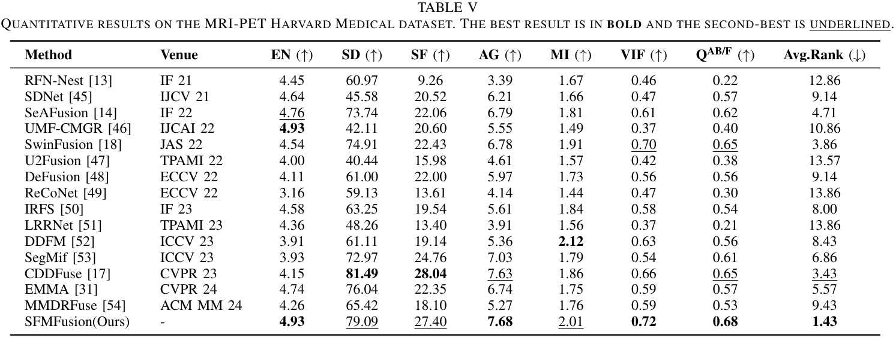
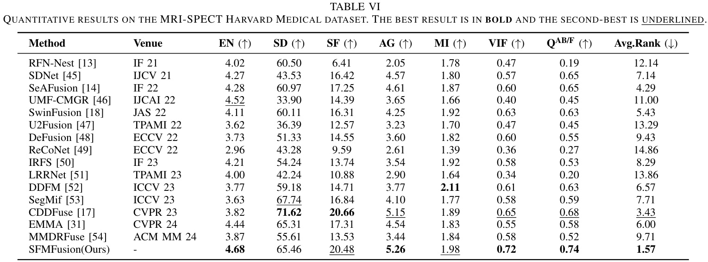

## Visualizations
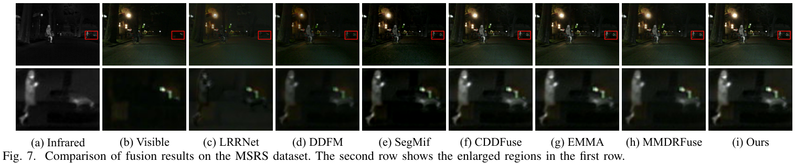
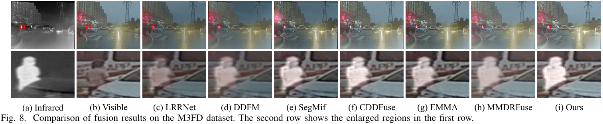
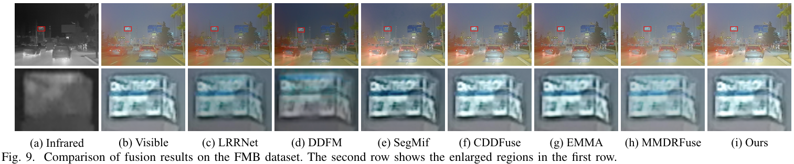
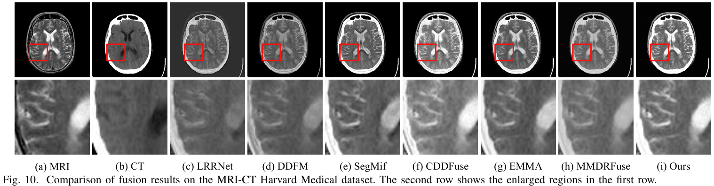
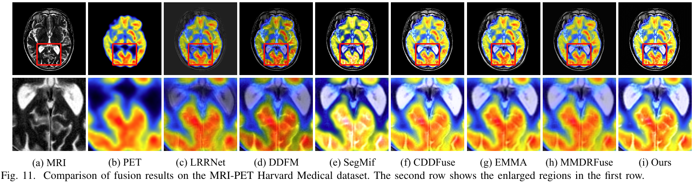
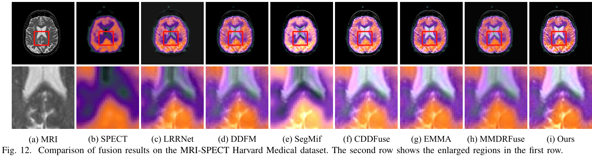

## Reproduction
### Datasets
We use the following datasets. Please organize the files following the directory structure of the MSRS folder under data.
- **MSRS**: [Download here](https://github.com/Linfeng-Tang/MSRS)
- **M3FD**: [Download here](https://github.com/JinyuanLiu-CV/TarDAL)  
- **FMB**: [Download here](https://github.com/JinyuanLiu-CV/SegMiF) 
- **Harvard**: [Download here](https://www.med.harvard.edu/AANLIB/home.html)
### Requirements
- Python 3.9.12
- PyTorch 2.0.1
- CUDA 12.2
- mamba_ssm 2.0.4
### Usage
#### 1)Train
```train
python train.py
```
#### 2)Test with pretrained weights
```test
python test.py
```
#### 3)Evaluate metrics
```test_metric
python test_metric.py
```
## Citation
If you find SFMFusion useful in your research, please consider citing:
```bibtex
@article{sun2025spatial,
  title={Spatial-Frequency Enhanced Mamba for Multi-Modal Image Fusion},
  author={Sun, Hui and Lv, Long and Zhang, Pingping and Tang, Tongdan and Tian, Feng and Sun, Weibing and Lu, Huchuan},
  journal={arXiv preprint arXiv:2511.06593},
  year={2025}
}

