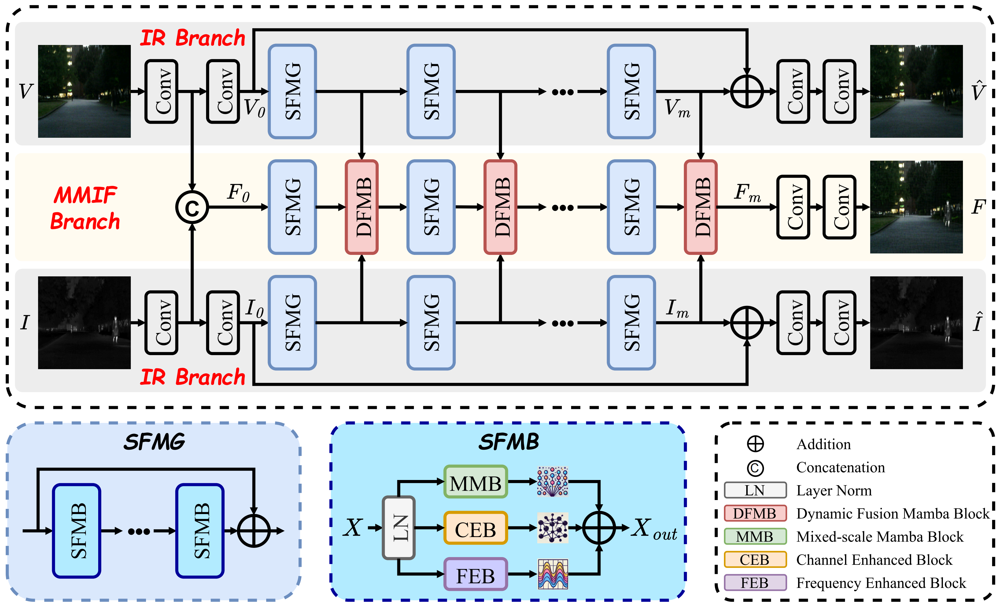

  <h1 align="center">Spatial-Frequency Enhanced Mamba for Multi-Modal Image Fusion</h1>

    <a href="https://arxiv.org/pdf/2511.06593v1" rel="external nofollow noopener" target="_blank">TIP 2025 Paper</a>

**TOP-ReID** is a powerful multi-spectral object Re-identification (ReID) framework designed to retrieve specific objects by leveraging complementary information from different image spectra. It overcomes the limitations of traditional single-spectral ReID in complex visual environments by reducing distribution gap and enhancing cyclic feature aggregation among different image spectra. Besides, TOP-ReID achieves advanced performance in multi-spectral and missing-spectral object ReID and holds great potential under cross-spectral settings.

## News
Exciting news! Our paper has been accepted by the TIP 2025! 🎉 [Paper](<https://arxiv.org/pdf/2511.06593v1>)

# SFMFusion

Official implementation of **"Spatial-Frequency Enhanced Mamba for Multi-Modal Image Fusion"**

---

## 📌 Introduction
SFMFusion is a Multi-Modal Image Fusion framework based on the Spatial-Frequency enhanced Mamba.  
This repository provides the training and testing code, along with pretrained weights for reproducing the results in our paper.

---

## 🔧 Requirements
- Python 3.9.12
- PyTorch 2.0.1
- CUDA 12.2
- mamba_ssm 2.0.4

---

## 📂 Dataset Preparation
We use the following datasets.
- **MSRS**: [Download here](https://github.com/Linfeng-Tang/MSRS)
- **M3FD**: [Download here](https://github.com/JinyuanLiu-CV/TarDAL)  
- **FMB**: [Download here](https://github.com/JinyuanLiu-CV/SegMiF) 
- **Harvard**: [Download here](https://www.med.harvard.edu/AANLIB/home.html)
  
Please organize the files following the directory structure of the MSRS folder under data.

---

## 🚀 Usage
### 1)Train
python train.py
### 2)Test with pretrained weights
python test.py
### 3)Evaluate metrics
python test_metric.py
